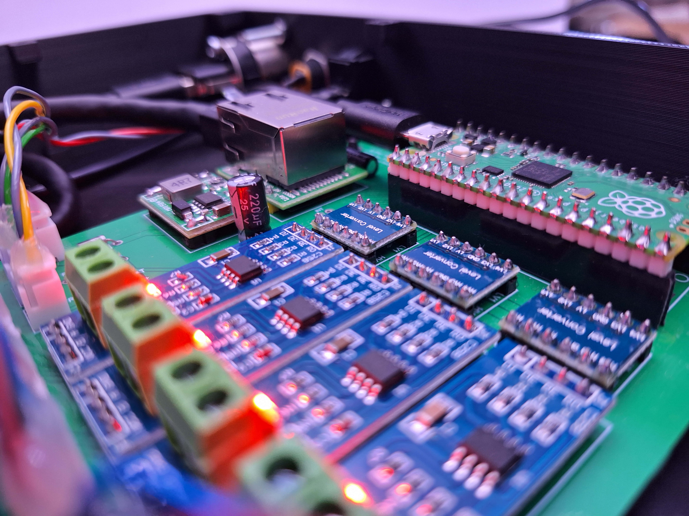
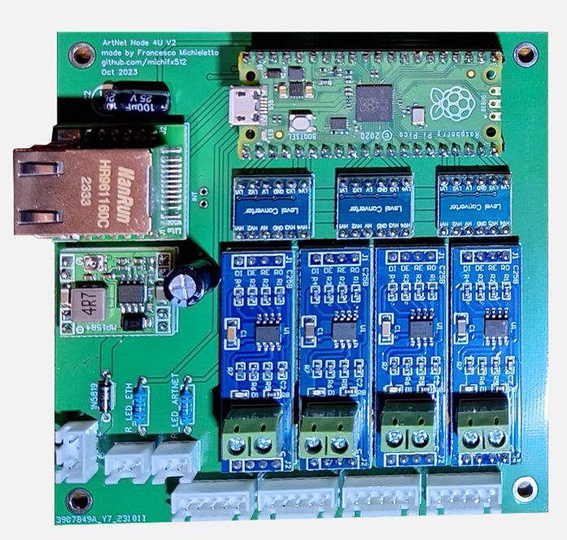

# FM-ArtNetNode_4U_V2
Custom Made Four Universe ArtNet to DMX Node based on Raspberry Pi Pico
## Table of Contents
- [1. Introduzione](#1-introduzione)
- [2. Percorso di realizzazione](#2-percorso-di-realizzazione)
  - [2.1 - Analisi preliminare](#21---analisi-preliminare)
  - [2.2 - Progettazione, Scelta componenti, Disegno PCB, disegno CAD](#22---progettazione-scelta-componenti-disegno-pcb-disegno-cad)
  - [2.3 - Realizzazione, Test Circuito, Programmazione Firmware](#23---realizzazione-test-circuito-programmazione-firmware)
  - [2.4 - Test e Migliorie](#24---test-e-migliorie)
- [3. Conclusioni](#3-conclusioni)
- [Visualizza ulteriori informazioni (Documento Completo)](#visualizza-ulteriori-informazioni)
---

   
   
   
   

---
[Puoi visualizzare il documento di progetto completo qui](./FM-ArtNetNode.pdf)
--

## 1. Introduzione

FM-ArtNetNode è un dispositivo progettato per analizzare i protocolli Ethernet come ArtNet e trasmettere i dati estratti su un bus DMX, utilizzato per il controllo di sistemi di illuminazione in eventi, concerti e discoteche. 
La completa realizzazione del progetto rappresenta il mio "capolavoro" per la maturità, in ambito extrascolastico.
Fasi dalla pregettazione della scheda PCB, scelta componenti, studio e risoluzione di problemi, sviluppo del firmware, test.

## 2. Percorso di realizzazione

### 2.1 - Analisi preliminare
---
1. **Utilizzo**: Controllo di sistemi di illuminazione da software e consolle che comunicano via ArtNet a DMX

2. **Protocollo DMX512**:
   - Standard industriale per il controllo dell’illuminazione.
   - Comunicazione differenziale RS-485 con fino a 512 canali (byte, valori da 0 a 255) per ogni universo.

3. **Numero di universi**: Ho scelto 4 universi, quindi 2048 canali DMX

4. **Protocollo ArtNet**:
   - ArtNet è un protocollo di rete che trasporta dati DMX512 su Ethernet.
   - Utilizza UDP per la trasmissione dei dati in tempo reale, con bassa latenza.
   - Un pacchetto ArtDmx è composto da 530 byte, di cui 18 di intestazione e fino a 512 byte DMX (uno per canale)

5. **Dimensioni**: 
   - Totali: 200mm x 150mm x 45mm (1U Rack)
   - PCB: 100mm x 100mm (per ridurre costi e migliorare le comunicazioni SPI ad alta frequenza)

### 2.2 - Progettazione, Scelta componenti, Disegno PCB, disegno CAD
---
**Componenti Principali**:
   - **Microcontrollore**: Raspberry Pi Pico, con 2 porte seriali fisiche e 8 porte seriali PIO.
   - **Chip MAX485**: per la comunicazione differenziale RS-485, standard DMX
   - **Interfaccia Ethernet**: Modulo WizNet W5500 lite.
   - **Logic level Shifter**: Per la comunicazione tra 3.3V e 5V.
   - **Altri Componenti**:convertitore DC-DC, diodi LED per indicazione attività, e condensatori per stabilizzazione.

**Progettazione e Disegno PCB**:
   - Design realizzato con EasyEDA.
   - PCB compatta (100mm x 100mm) per ridurre i costi e migliorare la sincronizzazione dei segnali.
   - Aggiunta di zone di rame per schermatura e riduzione delle interferenze.
   - Aggiunta di diodo per reverse voltage, protezione da più sorgenti simultanee
   - Aggiunta di condensatori di stabilizzazione, resistenze adatte a led

### 2.3 - Realizzazione, Test Circuito, Programmazione Firmware
---
**Costruzione Fisica**:
   - Saldatura dei componenti sulla PCB.
   - Progettazione e stampa 3D della scocca del dispositivo con AutoCAD.
   - Connessioni esterne per Ethernet, porte DMX, USB per aggiornamenti firmware, e alimentazione.

**Sviluppo del Firmware**:
   - Programmazione del microcontrollore in C/C++.
   - Implementazione di funzioni per la gestione del segnale ArtNet e la trasmissione DMX.
   - Implementazione di memoria dell'ultimo pacchetto
   - Gestione dei led di stato alla ricezione di pacchetti
   - Gestione di stampe di debug su seriale

### 2.4 - Test e Migliorie
---
   - Test di funzionamento con stress test di lunga durata e alta frequenza di pacchetti.
   - Implementazione di funzioni aggiuntive come la memoria dell’ultimo frame e un web server per configurazioni IP, MAC, Universi e porte utilizzate.

## 3. Conclusioni

Il progetto FM-ArtNetNode è stato un’esperienza formativa entusiasmante che mi ha permesso di sviluppare competenze in elettronica, informatica, sistemi e reti. Realizzare un dispositivo funzionale da zero, in grado di gestire e controllare sistemi di illuminazione complessi, è stato molto soddisfacente e rappresenta appieno il mio percorso di studi e la mia passione per il mondo dello spettacolo.

## Visualizza ulteriori informazioni

Per ulteriori dettagli, puoi visualizzare il documento di progetto completo [qui](./FM-ArtNetNode.pdf).
